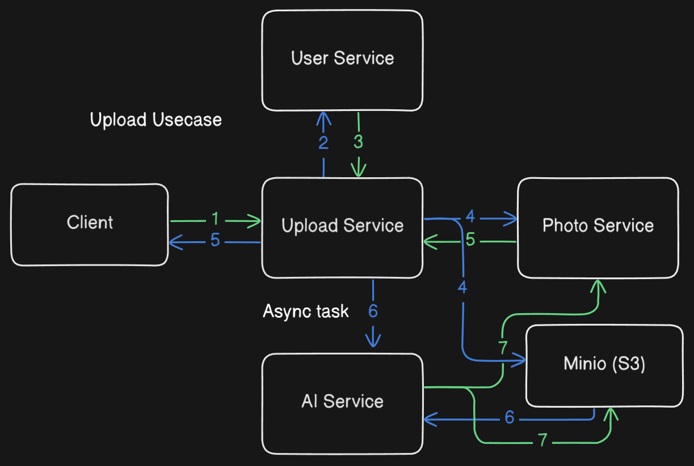

# 📸 Backend Microservice Application Supporting AI Face Recognition (Like Fotoyu)

This repository contains a **microservice-based backend** architecture built to support AI-driven features such as **face recognition** and **image embedding**, similar to the functionality of the **Fotoyu** application. The backend is designed to be scalable, efficient, and ready for AI integration.

## 📦 Microservices Overview

### 1. Upload Service
- Handles image uploads and compression (**CPU-intensive**)
- Isolated for scalability and performance
- Prevents blocking of I/O-bound services like Photo Service

### 2. Photo Service
- Manages image metadata and access
- Designed as **I/O-focused** microservice
- Communicates with Upload Service via **gRPC**

### 3. Transaction Service
- Manages user transactions and related operations
- Independent domain to support future financial or logging features

### 4. User Service
- Handles authentication, user profiles, and user data
- Acts as a foundational service for all identity-based interactions

---

## ⚙️ Design Principles

- **Scalability**  
  CPU-heavy services (e.g., image compression in Upload Service) are separated to allow independent scaling.

- **Concurrency Optimization**  
  IO-bound (Photo Service) and CPU-bound (Upload Service) workloads are decoupled for efficient resource utilization.

- **Domain-Driven Design**  
  Clear separation of concerns across Upload, Photo, Transaction, and User domains for better maintainability and extensibility.

---

## 🛠 Tech Stack

- **Language**: Go (Golang)
- **Web Framework**: [Fiber](https://gofiber.io)
- **Communication**: gRPC
- **Database**: PostgreSQL
- **Cache/Session**: Redis
- **Service Discovery**: Consul

---

## 🤖 AI Integration

Integration of AI-based Face Recognition and Image Embedding is **now available**!  
This feature enhances the system with intelligent photo processing and identity recognition, designed to integrate seamlessly with existing **Upload** and **Photo** services.

You can access and deploy the dedicated AI service from the following repository:  
👉 [AI Face Recognition Service – ai-yourmoments](https://github.com/hervibest/ai-yourmoments)

---

## 📸 Upload Use Case Flow

This document describes the flow of the image upload and processing system across microservices.

### 🧩 Components

- **Client**
- **Upload Service**
- **User Service**
- **Photo Service**
- **AI Service**
- **Minio (S3)**

---

### 🔁 Flow Description

1. **Client → Upload Service**  
   The client sends a request to upload an image to the Upload Service via HTTP/REST.

2. **Upload Service → User Service**  
   The Upload Service authenticates the user by calling the User Service via gRPC, using a JWT token.

3. **User Service → Upload Service**  
   The User Service authorizes the token and grants access, allowing the Upload Service to continue to the upload controller.

4. **Upload Service ↔ Photo Service & Minio (S3)**  
   The Upload Service updates the photo metadata (RAW) in the database and uploads the raw image to Minio (S3) for storage.

5. **Upload Service → Client**  
   The Upload Service starts a compression task and triggers the AI Service call asynchronously using a background goroutine. A successful upload response is returned to the client immediately, without waiting for AI processing results.

6. **Upload Service → AI Service (Async)**  
   The AI Service receives the task via gRPC, downloads the compressed image from Minio (S3), and performs the following processing pipeline:
   - Face recognition  
   - Embedding generation  
   - Similarity calculation  

7. **AI Service ↔ Photo Service & Minio (S3)**  
   The AI Service sends the similarity results to the Photo Service via gRPC. The processed image (e.g., with bounding boxes) is then uploaded back to Minio (S3).

---

### 🗂️ Technologies Used

- HTTP/REST for external API communication
- gRPC for inter-service communication
- Go routines for asynchronous processing
- Minio (S3-compatible) for object storage

## 🚧 Project Status

This project is actively being developed and intended for future expansion with:
- AI capabilities
- Observability and monitoring tools
- CI/CD support
- Dockerized deployment

---

